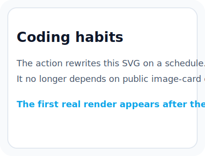

  

  

    Building reliable intelligent systems for research and real-world deployment.
  

  
  
  

  

---

## About Me
I focus on embodied agents, multimodal reasoning, and foundation-model-driven systems, with an emphasis on research that is both technically rigorous and practically deployable.

### Research Interests
- Embodied AI
- Agentic AI
- Multimodal Learning
- Foundation Models

## GitHub Highlights

  

  
  

  Auto-generated inside this repository every 30 minutes via GitHub Actions. GitHub contribution data can still take up to 24 hours to appear.

  

